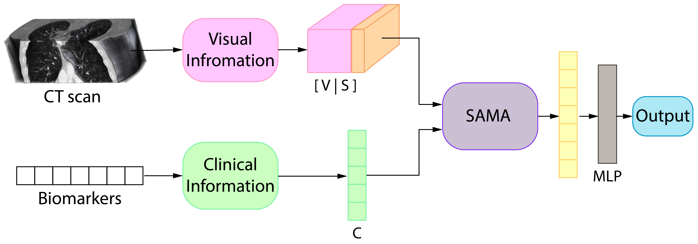

# SAMA: Spatially-Aware Multimodal Network with Attention for Early Lung Cancer Diagnosis

This is an implementation of SAMA on Python 3. The model generates a prediction of lung cancer from multimodal data. We process multimodal data in two parallel branches, the output goes through our SAMA module, which performs spatially-aware attention and then fusion with channel attention. Lastly, the fused representation obtained goes through an MLP to produce the final prediction.

This repository includes:

* Source code for SAMA with LUCAS backbone
* Training code for LUCAS dataset
* Pretrained weights for LUCAS dataset (available soon)

## Preparation

Install the dataset and its requirements following the [LUCAS: LUng CAncer Screening with Multimodal Biomarkers](https://github.com/BCV-Uniandes/LUCAS) repository. 

You can find the required dependencies for SAMA in [requirements.txt](/requirements.txt)

## Training

Pretrained weights and model will be available soon. To finetune SAMA with the pretrained weights, run this line:

    python main.py --config_file configuration_files/config_SAMA.yaml --name Pretrained_SAMA --desc --image --gpu 0 --ft --freeze --load_model last_model.pt

The [configuration_files](/configuration_files) are yaml files with the hiperparameters used to run experiments. You can modify and customize them to run SAMA with your data.

Some qualitative results that were obtained with SAMA:

## License
This project is under the BSD 3-Clause license. See [LICENSE](/LICENSE) for details.
  
